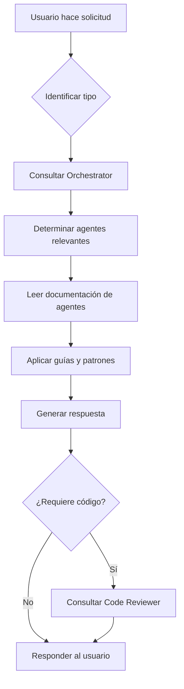

# 🤖 Reglas de Consulta Automática de Agentes

## Propósito

Este documento establece las reglas para que el asistente de IA **SIEMPRE** consulte los agentes antes de responder a cualquier solicitud del usuario.

---

## 📋 Regla Principal

> **ANTES de responder a CUALQUIER solicitud del usuario, DEBES:**
> 1. Identificar qué agentes son relevantes para la solicitud
> 2. Revisar la documentación de esos agentes en `.claude/agents/`
> 3. Aplicar las guías y patrones establecidos por los agentes
> 4. Responder siguiendo las mejores prácticas documentadas

---

## 🎯 Matriz de Consulta por Tipo de Solicitud

### 1. Solicitudes de Código

**Agentes a Consultar:**
- 🔍 **Code Reviewer** (`.claude/agents/code-reviewer.md`) - SIEMPRE
- 🏗️ **Architect** (`.claude/agents/architect.md`) - Para cambios arquitectónicos
- 💻 **Skills Developer** (`.claude/agents/skills-developer.md`) - Para implementación

**Checklist:**
- [ ] ¿El código sigue los patrones establecidos?
- [ ] ¿Cumple con las reglas de seguridad?
- [ ] ¿Está bien documentado?
- [ ] ¿Tiene tests?

### 2. Nuevas Features

**Agentes a Consultar:**
- 🎭 **Orchestrator** (`.claude/agents/orchestrator.md`) - SIEMPRE (coordinación)
- 🏗️ **Architect** (`.claude/agents/architect.md`) - Diseño
- 💻 **Skills Developer** (`.claude/agents/skills-developer.md`) - Implementación
- 🎨 **UI/UX Designer** (`.claude/agents/ui-ux-designer.md`) - Si tiene UI
- 🧪 **Tester** (`.claude/agents/tester.md`) - Tests
- 📝 **Documenter** (`.claude/agents/documenter.md`) - Documentación

**Workflow:**
1. Orchestrator → Planifica
2. Architect → Diseña
3. Skills Developer → Implementa
4. UI/UX Designer → Diseña UI (si aplica)
5. Tester → Crea tests
6. Code Reviewer → Revisa
7. Documenter → Documenta

### 3. Cambios de UI/UX

**Agentes a Consultar:**
- 🎨 **UI/UX Designer** (`.claude/agents/ui-ux-designer.md`) - SIEMPRE
- 🔍 **Code Reviewer** (`.claude/agents/code-reviewer.md`) - Accesibilidad
- 💻 **Skills Developer** (`.claude/agents/skills-developer.md`) - Implementación

**Checklist:**
- [ ] ¿Sigue el design system?
- [ ] ¿Es responsive?
- [ ] ¿Es accesible (WCAG 2.1)?
- [ ] ¿Usa componentes base existentes?

### 4. Refactoring

**Agentes a Consultar:**
- 🏗️ **Architect** (`.claude/agents/architect.md`) - SIEMPRE (estrategia)
- 🔍 **Code Reviewer** (`.claude/agents/code-reviewer.md`) - Validación
- 💻 **Skills Developer** (`.claude/agents/skills-developer.md`) - Implementación
- 🧪 **Tester** (`.claude/agents/tester.md`) - Tests de regresión

**Checklist:**
- [ ] ¿Mejora la arquitectura?
- [ ] ¿Mantiene funcionalidad?
- [ ] ¿Tiene tests?
- [ ] ¿Está documentado el cambio?

### 5. Testing

**Agentes a Consultar:**
- 🧪 **Tester** (`.claude/agents/tester.md`) - SIEMPRE
- 💻 **Skills Developer** (`.claude/agents/skills-developer.md`) - Contexto del código

**Checklist:**
- [ ] ¿Usa templates de Tester?
- [ ] ¿Cubre edge cases?
- [ ] ¿Cumple coverage goals?

### 6. Deployment

**Agentes a Consultar:**
- 🚀 **DevOps Engineer** (`.claude/agents/devops-engineer.md`) - SIEMPRE
- 🔍 **Code Reviewer** (`.claude/agents/code-reviewer.md`) - Seguridad

**Checklist:**
- [ ] ¿Build exitoso?
- [ ] ¿Tests pasando?
- [ ] ¿Lighthouse > 90?
- [ ] ¿Firebase rules seguras?

### 7. Documentación

**Agentes a Consultar:**
- 📝 **Documenter** (`.claude/agents/documenter.md`) - SIEMPRE

**Checklist:**
- [ ] ¿Usa templates de Documenter?
- [ ] ¿JSDoc completo?
- [ ] ¿README actualizado?

### 8. Análisis de Datos / IA

**Agentes a Consultar:**
- 📊 **Data Analyst** (`.claude/agents/data-analyst.md`) - SIEMPRE
- 💻 **Skills Developer** (`.claude/agents/skills-developer.md`) - Integración
- 🔍 **Code Reviewer** (`.claude/agents/code-reviewer.md`) - Seguridad de prompts

**Checklist:**
- [ ] ¿Usa aiGateway?
- [ ] ¿Tiene caché?
- [ ] ¿Maneja errores?
- [ ] ¿Aislamiento de usuarios?

---

## 🔄 Flujo de Trabajo Automático



---

## 📍 Ubicación de Agentes

Todos los agentes están en: **`.claude/agents/`**

```
.claude/agents/
├── orchestrator.md          # Coordinador principal
├── architect.md             # Arquitectura
├── skills-developer.md      # Desarrollo
├── ui-ux-designer.md        # Diseño UI/UX
├── code-reviewer.md         # Revisión de código
├── tester.md                # Testing
├── documenter.md            # Documentación
├── data-analyst.md          # Análisis de datos
└── devops-engineer.md       # DevOps
```

---

## ⚡ Reglas de Prioridad

### Siempre Consultar (Prioridad 1)
1. **Orchestrator** - Para coordinar tareas complejas
2. **Code Reviewer** - Para cualquier cambio de código
3. **Architect** - Para cambios arquitectónicos

### Consultar Según Contexto (Prioridad 2)
4. **Skills Developer** - Para implementación
5. **UI/UX Designer** - Para cambios de UI
6. **Tester** - Para testing
7. **Data Analyst** - Para análisis de datos

### Consultar Si Es Necesario (Prioridad 3)
8. **Documenter** - Para documentación
9. **DevOps Engineer** - Para deployment

---

## 🎯 Ejemplos de Aplicación

### Ejemplo 1: "Implementa un hook para gestionar notificaciones"

**Agentes a Consultar:**
1. ✅ **Orchestrator** - Coordinar tarea
2. ✅ **Skills Developer** - Template de hook
3. ✅ **Code Reviewer** - Validar implementación
4. ✅ **Tester** - Template de tests

**Pasos:**
1. Leer `skills-developer.md` → Sección "Custom Hooks Development"
2. Usar template de hook
3. Seguir patrones de QUANTA
4. Aplicar checklist de Code Reviewer
5. Crear tests según Tester

### Ejemplo 2: "Revisa este código"

**Agentes a Consultar:**
1. ✅ **Code Reviewer** - Checklist completo
2. ✅ **Architect** - Validar patrones

**Pasos:**
1. Leer `code-reviewer.md` → Sección "Review Checklist"
2. Aplicar checklist de seguridad
3. Aplicar checklist de calidad
4. Verificar patrones con Architect
5. Generar reporte de revisión

### Ejemplo 3: "Diseña una pantalla de estadísticas"

**Agentes a Consultar:**
1. ✅ **Orchestrator** - Coordinar
2. ✅ **Architect** - Estructura de componentes
3. ✅ **UI/UX Designer** - Design system
4. ✅ **Data Analyst** - Métricas a mostrar
5. ✅ **Skills Developer** - Implementación

**Pasos:**
1. Orchestrator → Planificar workflow
2. Architect → Diseñar estructura
3. UI/UX Designer → Aplicar design system
4. Data Analyst → Definir métricas
5. Skills Developer → Implementar

---

## 🚨 Reglas Críticas

### ❌ NUNCA Hacer Esto:
- Responder sin consultar agentes relevantes
- Ignorar patrones establecidos en los agentes
- Crear código que viole las guías de Code Reviewer
- Implementar sin seguir templates de Skills Developer

### ✅ SIEMPRE Hacer Esto:
- Leer documentación de agentes antes de responder
- Aplicar checklists de los agentes
- Seguir workflows establecidos
- Mencionar qué agentes consultaste

---

## 📊 Formato de Respuesta

Cuando respondas, incluye:

```markdown
## 🤖 Agentes Consultados

- ✅ **Orchestrator** - Coordinación de tarea
- ✅ **Code Reviewer** - Validación de código
- ✅ **Skills Developer** - Patrones de implementación

## 📋 Checklist Aplicado

- [x] Sigue patrones de QUANTA
- [x] Cumple reglas de seguridad
- [x] Tiene documentación JSDoc
- [x] Incluye tests

## 💡 Solución

[Tu respuesta siguiendo las guías de los agentes]
```

---

## 🔧 Mantenimiento

Este archivo debe actualizarse cuando:
- Se agreguen nuevos agentes
- Cambien los workflows
- Se identifiquen nuevos patrones

**Última actualización:** 21 de enero de 2026  
**Versión:** 1.0.0
