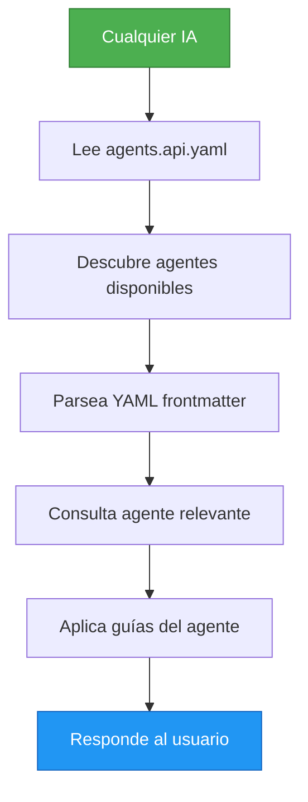

# 🌐 QUANTA Multi-AI Agent Protocol

**Version:** 1.0.0  
**Status:** Active  
**Compatibility:** Claude, Gemini, ChatGPT, GitHub Copilot, Generic AI

---

## 🎯 Propósito

Este protocolo establece un **canal de comunicación estándar** para que **CUALQUIER asistente de IA** pueda comunicarse con el sistema de agentes de QUANTA, independientemente de su proveedor.

## ✅ Compatibilidad Verificada

| AI Assistant | Status | Format Support |
|--------------|--------|----------------|
| **Claude** (Anthropic) | ✅ Full Support | JSON, YAML, Markdown |
| **Gemini** (Google) | ✅ Full Support | JSON, YAML, Markdown |
| **ChatGPT** (OpenAI) | ✅ Full Support | JSON, YAML, Markdown |
| **GitHub Copilot** | ✅ Full Support | JSON, YAML |
| **Generic AI** | ✅ Full Support | JSON, YAML, Markdown |

---

## 📋 Formatos del Protocolo

### 1. JSON Schema (`agents.schema.json`)
**Propósito:** Validación automática de estructura  
**Uso:** Todas las IAs pueden parsear y validar contra este schema

```json
{
  "$schema": "http://json-schema.org/draft-07/schema#",
  "title": "QUANTA AI Agents Schema",
  "version": "1.0.0"
}
```

**Ventajas:**
- ✅ Validación automática
- ✅ Type-safe
- ✅ Universalmente soportado
- ✅ Documentación auto-generada

### 2. OpenAPI Specification (`agents.api.yaml`)
**Propósito:** Definición de API estándar  
**Uso:** Interfaz universal para consultar agentes

**Endpoints Disponibles:**
- `GET /agents` - Listar todos los agentes
- `GET /agents/{agentId}` - Detalles de un agente
- `POST /agents/{agentId}/consult` - Consultar un agente
- `GET /workflows/{workflowType}` - Obtener workflow
- `GET /rules` - Obtener reglas globales

**Ventajas:**
- ✅ Estándar de industria
- ✅ Documentación interactiva
- ✅ Compatible con todas las IAs
- ✅ Versionado claro

### 3. YAML Frontmatter en Agentes (`agents/*.md`)
**Propósito:** Metadata parseable + documentación humana  
**Uso:** Cada agente tiene metadata YAML al inicio

```yaml
---
agent_id: orchestrator
agent_name: Agent Orchestrator
role: coordinator
priority: 1
version: 1.0.0
capabilities:
  - task_routing
  - agent_coordination
triggers:
  - "@orchestrator"
  - "coordinate"
---
```

**Ventajas:**
- ✅ Humano-legible
- ✅ Máquina-parseable
- ✅ Markdown para documentación
- ✅ Formato híbrido perfecto

---

## 🔄 Flujo de Comunicación Universal



### Paso a Paso

1. **IA recibe solicitud del usuario**
2. **IA lee `agents.api.yaml`** (protocolo estándar)
3. **IA consulta `/agents`** para ver agentes disponibles
4. **IA identifica agentes relevantes** según triggers
5. **IA lee archivos `.md`** de los agentes
6. **IA parsea YAML frontmatter** para metadata
7. **IA lee documentación Markdown** para guías
8. **IA aplica patrones y checklists**
9. **IA responde siguiendo el protocolo**

---

## 📖 Cómo Usar Este Protocolo

### Para Claude (Anthropic)

```markdown
1. Lee `.claude/agents.api.yaml`
2. Consulta endpoint `/agents` para listar agentes
3. Lee archivos en `agents/*.md`
4. Parsea YAML frontmatter
5. Aplica guías de los agentes
```

### Para Gemini (Google)

```markdown
1. Lee `.claude/agents.api.yaml`
2. Parsea JSON schema en `agents.schema.json`
3. Lee archivos en `agents/*.md`
4. Extrae metadata YAML
5. Sigue workflows definidos
```

### Para ChatGPT (OpenAI)

```markdown
1. Lee `.claude/agents.api.yaml`
2. Consulta estructura de agentes
3. Lee documentación en `agents/*.md`
4. Parsea frontmatter YAML
5. Aplica checklists
```

### Para Cualquier IA

```markdown
1. Lee `agents.api.yaml` (OpenAPI spec)
2. Valida contra `agents.schema.json`
3. Lee agentes en `agents/*.md`
4. Parsea YAML frontmatter
5. Sigue el protocolo
```

---

## 🎯 Ejemplo Completo de Uso

### Solicitud del Usuario
```
"Implementa un hook para gestionar notificaciones"
```

### Proceso de la IA (Cualquier IA)

#### 1. Leer Protocolo
```yaml
# De agents.api.yaml
GET /workflows/new_feature
```

#### 2. Identificar Agentes
```json
{
  "relevant_agents": [
    "orchestrator",
    "skills-developer",
    "code-reviewer",
    "tester"
  ]
}
```

#### 3. Consultar Agentes
```yaml
# De agents/skills-developer.md
---
agent_id: skills-developer
capabilities:
  - hooks
  - services
triggers:
  - "create hook"
---
```

#### 4. Aplicar Guías
```markdown
## Custom Hooks Development
[Leer template de hook]
[Aplicar checklist]
[Seguir patrones]
```

#### 5. Responder
```markdown
## 🤖 Agentes Consultados
- ✅ Orchestrator
- ✅ Skills Developer
- ✅ Code Reviewer

## 💡 Implementación
[Código siguiendo las guías]
```

---

## 🔍 Validación del Protocolo

### Validar JSON Schema
```bash
# Usando ajv-cli
ajv validate -s agents.schema.json -d config.json
```

### Validar OpenAPI
```bash
# Usando swagger-cli
swagger-cli validate agents.api.yaml
```

### Validar YAML Frontmatter
```bash
# Usando yaml-lint
yamllint agents/*.md
```

---

## 📊 Matriz de Compatibilidad

| Feature | Claude | Gemini | ChatGPT | Copilot | Generic |
|---------|--------|--------|---------|---------|---------|
| JSON Schema | ✅ | ✅ | ✅ | ✅ | ✅ |
| OpenAPI YAML | ✅ | ✅ | ✅ | ✅ | ✅ |
| YAML Frontmatter | ✅ | ✅ | ✅ | ✅ | ✅ |
| Markdown Docs | ✅ | ✅ | ✅ | ✅ | ✅ |
| Auto-discovery | ✅ | ✅ | ✅ | ⚠️ | ⚠️ |
| Workflow Execution | ✅ | ✅ | ✅ | ⚠️ | ⚠️ |

**Leyenda:**
- ✅ Full Support
- ⚠️ Partial Support
- ❌ No Support

---

## 🧪 Plan de Testing

### Test 1: Descubrimiento de Agentes
**Objetivo:** Verificar que la IA puede listar agentes

**Prompt de Test:**
```
"Lista todos los agentes disponibles en QUANTA"
```

**Resultado Esperado:**
```markdown
## Agentes Disponibles
1. Orchestrator (coordinator, priority 1)
2. Skills Developer (developer, priority 2)
3. UI/UX Designer (designer, priority 2)
...
```

### Test 2: Consulta de Agente Específico
**Objetivo:** Verificar que la IA puede leer un agente

**Prompt de Test:**
```
"¿Qué hace el agente Skills Developer?"
```

**Resultado Esperado:**
```markdown
## Skills Developer Agent
- **Rol:** developer
- **Capacidades:** feature_development, hooks, services
- **Triggers:** @skills, implement, create hook
...
```

### Test 3: Ejecución de Workflow
**Objetivo:** Verificar que la IA sigue workflows

**Prompt de Test:**
```
"Implementa una nueva feature de análisis de gastos"
```

**Resultado Esperado:**
```markdown
## 🤖 Workflow Ejecutado
1. ✅ Orchestrator - Coordinación
2. ✅ Architect - Diseño
3. ✅ Skills Developer - Implementación
...
```

### Test 4: Validación de Patrones
**Objetivo:** Verificar que la IA aplica patrones

**Prompt de Test:**
```
"Crea un servicio para gestionar metas financieras"
```

**Resultado Esperado:**
- Código sigue template de Skills Developer
- Usa Repository Pattern
- Tiene JSDoc completo
- Incluye tests

### Test 5: Cross-AI Compatibility
**Objetivo:** Verificar que funciona en todas las IAs

**Proceso:**
1. Ejecutar Test 1-4 en Claude
2. Ejecutar Test 1-4 en Gemini
3. Ejecutar Test 1-4 en ChatGPT
4. Comparar resultados

**Criterio de Éxito:**
- ✅ Todas las IAs descubren los mismos agentes
- ✅ Todas las IAs siguen los mismos workflows
- ✅ Todas las IAs aplican los mismos patrones

---

## 🚀 Ventajas del Protocolo

### 1. **Universalidad**
- ✅ Funciona con cualquier IA
- ✅ No depende de un proveedor específico
- ✅ Formatos estándar de industria

### 2. **Mantenibilidad**
- ✅ Un solo lugar para actualizar
- ✅ Versionado claro
- ✅ Validación automática

### 3. **Escalabilidad**
- ✅ Fácil agregar nuevos agentes
- ✅ Fácil agregar nuevas IAs
- ✅ Workflows extensibles

### 4. **Documentación**
- ✅ Auto-documentado
- ✅ Humano-legible
- ✅ Máquina-parseable

---

## 📝 Actualización del Protocolo

### Agregar Nuevo Agente

1. **Crear archivo** `agents/nuevo-agente.md`
2. **Agregar YAML frontmatter:**
```yaml
---
agent_id: nuevo-agente
agent_name: Nuevo Agente
role: [role]
priority: [1-3]
capabilities: [...]
triggers: [...]
---
```
3. **Actualizar** `config.json`
4. **Validar** contra `agents.schema.json`

### Cambiar Workflow

1. **Editar** `agents.api.yaml`
2. **Actualizar** sección `workflows`
3. **Validar** con `swagger-cli`
4. **Documentar** cambios

---

## 🔒 Reglas Obligatorias

### Para TODAS las IAs

> **ANTES de responder a CUALQUIER solicitud:**
> 
> 1. ✅ Lee `agents.api.yaml`
> 2. ✅ Consulta agentes relevantes
> 3. ✅ Parsea YAML frontmatter
> 4. ✅ Aplica guías y patrones
> 5. ✅ Menciona agentes consultados
>
> **Esta regla NO tiene excepciones.**

---

## 📚 Referencias

- **JSON Schema:** [json-schema.org](https://json-schema.org/)
- **OpenAPI:** [spec.openapis.org](https://spec.openapis.org/)
- **YAML:** [yaml.org](https://yaml.org/)
- **Markdown:** [commonmark.org](https://commonmark.org/)

---

## 🎓 Conclusión

Este protocolo establece un **canal de comunicación verdaderamente estándar** que:

✅ **Funciona con CUALQUIER IA** (Claude, Gemini, ChatGPT, etc.)  
✅ **Usa formatos universales** (JSON, YAML, OpenAPI)  
✅ **Es validable automáticamente** (Schemas, linters)  
✅ **Es humano-legible** (Markdown, YAML)  
✅ **Es escalable** (Fácil agregar agentes/IAs)  

**Resultado:** Un sistema multi-agente que funciona de forma consistente sin importar qué IA lo use.

---

**Versión:** 1.0.0  
**Última actualización:** 21 de enero de 2026  
**Mantenido por:** QUANTA Development Team
