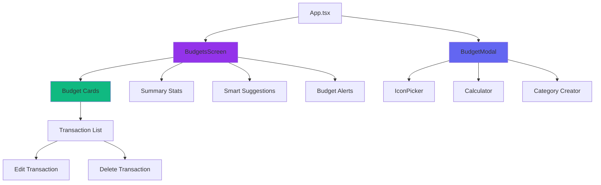

# 📊 Vista de Presupuestos - Documentación Completa

**QUANTA Finance App**
Versión: 2.0
Última actualización: Enero 2026

---

## 📑 Índice

1. [Resumen Ejecutivo](#resumen-ejecutivo)
2. [Arquitectura Técnica](#arquitectura-técnica)
3. [Componentes UI](#componentes-ui)
4. [Flujo de Datos](#flujo-de-datos)
5. [Lógica de Negocio](#lógica-de-negocio)
6. [Casos de Uso](#casos-de-uso)
7. [Testing y Validación](#testing-y-validación)
8. [Diseño Visual](#diseño-visual)
9. [Optimizaciones](#optimizaciones)
10. [Troubleshooting](#troubleshooting)

---

## 1. Resumen Ejecutivo

### 🎯 Propósito

La **Vista de Presupuestos** es un módulo crítico de QUANTA que permite a los usuarios:

- **Crear y gestionar presupuestos** por categoría (mensuales o anuales)
- **Monitorear gastos en tiempo real** comparados con límites establecidos
- **Recibir alertas inteligentes** cuando se acercan o exceden presupuestos
- **Obtener sugerencias basadas en IA** para optimizar su distribución financiera
- **Visualizar tendencias** y patrones de gasto período a período

### ✨ Características Principales

#### 🔹 Navegación Temporal
- Selector de período (mes/año) con navegación hacia atrás
- Restricción: No se puede navegar al futuro
- Vista adaptativa: muestra datos del período seleccionado

#### 🔹 Dashboard Inteligente
- **Resumen visual** con gradient dinámico según estado (healthy/warning/critical)
- **Estadísticas agregadas**: Total presupuestado vs gastado
- **Barra de progreso global** con indicador de porcentaje

#### 🔹 Alertas y Sugerencias
- **Alertas automáticas** cuando se alcanza el 80% o 100% del presupuesto
- **Sugerencias inteligentes** basadas en patrones de gasto histórico (últimos 3 meses)
- **Detección de categorías sin presupuesto** con gasto significativo (>$1000)

#### 🔹 Gestión Avanzada
- **Creación dinámica de categorías** directamente desde el modal
- **Personalización visual** (icono + color) por presupuesto
- **Vista expandible** con lista de transacciones por presupuesto
- **Calculadora integrada** para entrada de montos

---

## 2. Arquitectura Técnica

### 📦 Estructura de Archivos

```
components/
├── BudgetsScreen.tsx       # Vista principal (lista + stats)
├── BudgetModal.tsx         # Modal de creación/edición
└── BudgetView.tsx          # Vista full-screen (alternativa)

services/
└── budgetService.ts        # Lógica de negocio y cálculos

hooks/
└── useBudgetHandlers.ts    # Handlers reutilizables (CRUD)

types.ts                    # Definiciones TypeScript
```

### 🧩 Diagrama de Componentes



### 📊 Modelo de Datos

#### Budget Type (types.ts:183-198)

```typescript
export interface Budget {
  id: string;
  userId?: string;              // User owner
  category: string;             // Category ID (e.g., "food", "transport")
  name: string;                 // Display name (e.g., "Supermercado")
  limit: number;                // Budget limit amount
  spent?: number;               // Current spending (calculated)
  period: 'monthly' | 'yearly'; // Reset frequency
  color?: string;               // Visual color (purple, emerald, etc.)
  icon?: string;                // Lucide icon name
  isActive?: boolean;           // Soft delete flag
  createdAt?: number;           // Creation timestamp
  updatedAt?: number;           // Last modification
  resetDay?: number;            // Day of month to reset (1-31)
}
```

#### BudgetAlert Type

```typescript
export interface BudgetAlert {
  id: string;
  budgetId: string;
  type: 'saving' | 'overspending' | 'warning';
  amount: number;         // Difference (+ savings, - overspent)
  percentage: number;     // Usage percentage
  message: string;        // Localized message
  timestamp: number;
  isRead?: boolean;
}
```

### 🔄 Flujo de Datos (Redux-like Pattern)

```
User Action → Handler (useBudgetHandlers)
              ↓
         Context Update (SettingsContext)
              ↓
         Firestore Sync (storageService)
              ↓
         Local State Refresh
              ↓
         UI Re-render
```

#### Ejemplo: Crear Presupuesto

```typescript
// 1. Usuario llena formulario en BudgetModal
const formData = {
  name: "Supermercado",
  category: "food_custom_id",
  limit: 5000,
  period: "monthly",
  color: "emerald",
  icon: "ShoppingCart"
};

// 2. Submit → useBudgetHandlers.handleSaveBudget()
handleSaveBudget(formData);

// 3. Crea objeto Budget completo
const newBudget: Budget = {
  id: `budget_${Date.now()}`,
  ...formData,
  userId: user.uid,
  spent: 0,
  isActive: true,
  createdAt: Date.now(),
  updatedAt: Date.now()
};

// 4. Persiste en Firestore
await updateBudget(newBudget);

// 5. Context actualiza estado local
setSettings(prev => ({
  ...prev,
  budgets: [...prev.budgets, newBudget]
}));
```

---

## 3. Componentes UI

### 🖼️ BudgetsScreen.tsx

**Responsabilidades**:
- Vista principal con lista de presupuestos
- Selector de período (mes/año)
- Estadísticas agregadas
- Alertas y sugerencias

#### 📌 Props Interface

```typescript
interface BudgetsScreenProps {
  budgets: Budget[];
  transactions: Transaction[];
  onCreateBudget: () => void;
  onEditBudget: (budget: Budget) => void;
  onDeleteBudget: (budgetId: string) => void;
  onEditTransaction?: (transaction: Transaction) => void;
  onDeleteTransaction?: (transactionId: string) => void;
}
```

#### 🔍 Hooks Principales

| Hook | Propósito | Tipo |
|------|-----------|------|
| `useState<string \| null>(null)` | expandedBudget | Estado de expansión de cards |
| `useState(YYYY-MM)` | currentPeriod | Período seleccionado |
| `useMemo()` | budgetsWithPeriodData | Calcula `spent` por período |
| `useMemo()` | alerts | Genera alertas de sobregasto |
| `useMemo()` | suggestions | Sugerencias inteligentes |
| `useCurrency()` | formatAmount, convertAmount | Formateo de moneda |

#### 🎨 Secciones de la UI

##### **1. Header Sticky**
```typescript
// components/BudgetsScreen.tsx:204-230
<div className="sticky top-0 z-10 bg-white dark:bg-slate-800">
  <h1>Presupuestos</h1>

  {/* Period Selector */}
  <div className="flex items-center justify-between">
    <button onClick={() => changeMonth('prev')}>←</button>
    <span>{currentPeriod}</span>
    <button onClick={() => changeMonth('next')} disabled={isCurrentMonth}>→</button>
  </div>
</div>
```

**Características**:
- `position: sticky` para scroll infinito con header visible
- Navegación de período con `changeMonth('prev' | 'next')`
- Botón "Next" deshabilitado si es mes actual

##### **2. Main Stats Card**
```typescript
// components/BudgetsScreen.tsx:233-284
<div className={`rounded-2xl p-5 ${
  summaryStats.percentage >= 90 ? 'bg-gradient-to-br from-rose-500 to-orange-600' :
  summaryStats.percentage >= 70 ? 'bg-gradient-to-br from-amber-400 to-orange-500' :
  'bg-gradient-to-br from-violet-600 to-purple-600'
}`}>
```

**Lógica de Color Dinámico**:
| Porcentaje | Color | Significado |
|------------|-------|-------------|
| < 70% | Purple gradient | ✅ Saludable |
| 70-89% | Amber gradient | ⚠️ Advertencia |
| ≥ 90% | Rose gradient | 🚨 Crítico |

##### **3. Budget List**
```typescript
// components/BudgetsScreen.tsx:414-598
{activeBudgets.map(budget => {
  const percentage = (budget.spent / budget.limit) * 100;
  const remaining = budget.limit - budget.spent;
  const progressColor = BudgetService.getProgressColor(percentage);

  return (
    <div key={budget.id} className="rounded-2xl border">
      {/* Header - Clickable para expandir */}
      <div onClick={() => toggleBudget(budget.id)}>
        <h3>{budget.name}</h3>
        <p>{formatAmount(budget.limit)}</p>
        <div className="progress-bar" style={{ width: `${percentage}%` }} />
      </div>

      {/* Transactions List (si está expandido) */}
      {isExpanded && (
        <div className="border-t">
          {budgetTransactions.map(tx => (
            <div key={tx.id}>
              <p>{tx.description}</p>
              <p>-{formatAmount(tx.amount)}</p>
              <button onClick={() => onEditTransaction(tx)}>✏️</button>
              <button onClick={() => onDeleteTransaction(tx.id)}>🗑️</button>
            </div>
          ))}
        </div>
      )}
    </div>
  );
})}
```

**Características**:
- **Accordion pattern**: Click en header toggle expand/collapse
- **Transacciones filtradas** por categoría + período
- **Edición inline** de transacciones desde la lista
- **Progress bar** con color semántico (emerald/amber/rose)

##### **4. Smart Suggestions**
```typescript
// components/BudgetsScreen.tsx:299-347
{suggestions.length > 0 && showSuggestions && (
  <div className="bg-gradient-to-r from-violet-500/10 to-purple-500/10">
    <Sparkles /> Sugerencias Inteligentes
    {suggestions.slice(0, 3).map((suggestion, idx) => (
      <div key={idx}>
        <Lightbulb />
        <p>{suggestion.message}</p>
        {suggestion.suggestedAmount && (
          <p>Sugerencia: {formatAmount(suggestion.suggestedAmount)}</p>
        )}
        {suggestion.action && (
          <button onClick={suggestion.action}>
            Aplicar sugerencia
          </button>
        )}
      </div>
    ))}
  </div>
)}
```

**Tipos de Sugerencias**:
| Tipo | Condición | Mensaje |
|------|-----------|---------|
| `reduce` | Gasto promedio < 85% del límite | "Podrías reducir el presupuesto y destinar la diferencia a ahorros" |
| `increase` | Gasto promedio > 95% del límite | "Considera aumentar el presupuesto para ser más realista" |
| `savings` | Gasto actual < 85% del límite | "Tienes $X disponibles. ¿Deseas transferirlos a tus metas?" |
| `create` | Categoría sin presupuesto + gasto > $1000 | "Gastas $X/mes en Y pero no tienes presupuesto. ¿Crear uno?" |

---

### 🖼️ BudgetModal.tsx

**Responsabilidades**:
- Formulario de creación/edición
- Validación de campos
- Creación dinámica de categorías
- Vista previa en tiempo real

#### 📌 Props Interface

```typescript
interface BudgetModalProps {
  isOpen: boolean;
  budget?: Budget | null;       // Si existe, modo edición
  categories: string[];
  onClose: () => void;
  onSave: (budget: Partial<Budget>) => void;
}
```

#### 🎨 Estructura del Formulario

```typescript
<form id="budget-form" onSubmit={handleSubmit}>
  {/* 1. Amount Input (autofocus) */}
  <input
    ref={amountRef}
    type="number"
    value={formData.limit}
    className="text-3xl text-center"
    autoFocus
  />
  <button onClick={() => setShowCalculator(true)}>
    <Calculator />
  </button>

  {/* 2. Budget Name (opcional) */}
  <input
    value={formData.name}
    placeholder="Ej: Gastos del hogar"
  />

  {/* 3. Category Selection (chips) */}
  <div className="flex flex-wrap gap-2">
    {expenseCategories.map(cat => (
      <button
        onClick={() => handleChange('category', cat.id)}
        className={isSelected ? 'ring-2 shadow-md' : ''}
      >
        <DynamicIcon name={cat.icon} />
        {cat.name[language]}
      </button>
    ))}
  </div>
  <button onClick={() => setShowNewCategoryForm(true)}>
    <Plus /> Nueva Categoría
  </button>

  {/* 4. Period Selection */}
  <button onClick={() => handleChange('period', 'monthly')}>
    Mensual
  </button>
  <button onClick={() => handleChange('period', 'yearly')}>
    Anual
  </button>

  {/* 5. Reset Day + Icon/Color */}
  <input
    type="number"
    min="1"
    max="31"
    value={formData.resetDay}
  />
  <button onClick={() => setShowIconPicker(true)}>
    <DynamicIcon name={formData.icon} />
    Cambiar
  </button>

  {/* 6. Preview */}
  <div className="preview-card">
    <DynamicIcon name={formData.icon} />
    <h3>{formData.name || categoryName}</h3>
    <p>{formData.period} • Reinicia el día {formData.resetDay}</p>
    <span>{formatAmount(formData.limit)}</span>
  </div>
</form>
```

#### ✅ Validación de Formulario

```typescript
// components/BudgetModal.tsx:101-120
const validateForm = (): boolean => {
  const newErrors: Record<string, string> = {};

  // 1. Category requerida
  if (!formData.category) {
    newErrors.category = language === 'es'
      ? 'La categoría es requerida'
      : 'Category is required';
  }

  // 2. Limit debe ser número > 0
  const limitNum = parseFloat(formData.limit);
  if (!formData.limit || isNaN(limitNum) || limitNum <= 0) {
    newErrors.limit = language === 'es'
      ? 'Ingresa un monto válido mayor a 0'
      : 'Enter a valid amount greater than 0';
  }

  // 3. Reset day debe estar entre 1-31
  const resetDay = parseInt(formData.resetDay);
  if (isNaN(resetDay) || resetDay < 1 || resetDay > 31) {
    newErrors.resetDay = language === 'es'
      ? 'Ingresa un día válido (1-31)'
      : 'Enter a valid day (1-31)';
  }

  setErrors(newErrors);
  return Object.keys(newErrors).length === 0;
};
```

#### 🆕 Creación Dinámica de Categorías

```typescript
// components/BudgetModal.tsx:168-185
const handleAddCategory = useCallback(async () => {
  if (newCatName.es && newCatName.en) {
    const newCat = await storageService.addCategory({
      key: newCatName.en.toLowerCase().replace(/\s+/g, '_'),
      name: newCatName,
      icon: newCatIcon,
      color: newCatColor,
      type: 'expense',
      order: customCategories.length
    });

    setCustomCategories([...customCategories, newCat]);
    handleChange('category', newCat.id);  // Auto-selecciona la nueva
    setShowNewCategoryForm(false);

    // Reset form
    setNewCatName({ es: '', en: '' });
    setNewCatIcon('Tag');
    setNewCatColor('purple');
  }
}, [newCatName, newCatIcon, newCatColor, customCategories, handleChange]);
```

**Flujo**:
1. Usuario click en "Nueva Categoría"
2. Aparece formulario inline con:
   - Botón de icono/color (abre IconPicker)
   - Input nombre español
   - Input nombre inglés
3. Click "Guardar" → Crea categoría en Firestore
4. Auto-selecciona la categoría recién creada
5. Cierra formulario inline

---

## 4. Flujo de Datos

### 📊 Cálculo de Spent por Período

**Ubicación**: `BudgetsScreen.tsx:124-132`

```typescript
const budgetsWithPeriodData = useMemo(() => {
  return budgets.map(b => {
    const txs = getTransactionsForBudget(b);
    const spent = txs.reduce((sum, t) => sum + t.amount, 0);
    return { ...b, spent, isActive: b.isActive };
  }).sort((a, b) => (b.spent - b.limit) - (a.spent - a.limit));
}, [budgets, transactions, currentPeriod]);
```

**Función Helper**: `getTransactionsForBudget()`

```typescript
// components/BudgetsScreen.tsx:105-121
const getTransactionsForBudget = (budget: Budget) => {
  return transactions.filter(tx => {
    if (tx.type !== 'expense' || tx.category !== budget.category) return false;

    const txDate = parseLocalDate(tx.date);

    if (budget.period === 'monthly') {
      // Filtrar solo transacciones del mes seleccionado
      return txDate.getFullYear() === year && txDate.getMonth() === monthIndex;
    } else {
      // Para anuales, mostrar todo el año seleccionado
      return txDate.getFullYear() === year;
    }
  }).sort((a, b) => parseLocalDate(b.date).getTime() - parseLocalDate(a.date).getTime());
};
```

**Importante**:
- ✅ **Filtra por período seleccionado** (no solo mes actual)
- ✅ **Diferencia entre monthly y yearly**
- ✅ **Ordena por fecha descendente**

---

### 🧠 Lógica de Negocio (budgetService.ts)

#### 🔍 Funciones Clave

##### 1. `calculateSpentForCategory()`

**Propósito**: Calcula gasto total de una categoría en un período

```typescript
// services/budgetService.ts:58-85
static calculateSpentForCategory(
  category: string,
  transactions: Transaction[],
  period: 'monthly' | 'yearly' = 'monthly'
): number {
  const now = new Date();
  const startDate = new Date();

  if (period === 'monthly') {
    startDate.setDate(1);        // Primer día del mes actual
    startDate.setHours(0, 0, 0, 0);
  } else {
    startDate.setMonth(0, 1);    // 1 de enero del año actual
    startDate.setHours(0, 0, 0, 0);
  }

  return transactions
    .filter(t => {
      const transDate = parseLocalDate(t.date);
      return (
        t.type === 'expense' &&
        t.category === category &&
        transDate >= startDate &&
        transDate <= now
      );
    })
    .reduce((sum, t) => sum + t.amount, 0);
}
```

**Uso**: Usado por `updateBudgetsWithSpending()` para calcular campo `spent`

##### 2. `findMatchingBudget()`

**Propósito**: Match inteligente entre transacciones y presupuestos

```typescript
// services/budgetService.ts:303-351
static findMatchingBudget(
  transaction: Transaction,
  budgets: Budget[]
): Budget | null {
  if (transaction.type !== 'expense') return null;

  const activeBudgets = budgets.filter(b => b.isActive);
  if (activeBudgets.length === 0) return null;

  // 1️⃣ Intenta match exacto de categoría
  const exactMatch = activeBudgets.find(
    b => b.category.toLowerCase() === transaction.category.toLowerCase()
  );
  if (exactMatch) return exactMatch;

  // 2️⃣ Match por keywords en descripción
  const description = (transaction.description || '').toLowerCase();
  const category = transaction.category.toLowerCase();

  for (const budget of activeBudgets) {
    const budgetName = budget.name.toLowerCase();
    const budgetCategory = budget.category.toLowerCase();

    const keywords = BUDGET_CATEGORY_KEYWORDS[budgetName] ||
                     BUDGET_CATEGORY_KEYWORDS[budgetCategory] || [];

    for (const keyword of keywords) {
      if (description.includes(keyword) || category.includes(keyword)) {
        return budget;
      }
    }
  }

  // 3️⃣ Fuzzy match de categorías relacionadas
  for (const budget of activeBudgets) {
    if (this.areCategoriesRelated(transaction.category, budget.category)) {
      return budget;
    }
  }

  return null;
}
```

**Ejemplo de Keywords**:
```typescript
const BUDGET_CATEGORY_KEYWORDS: Record<string, string[]> = {
  'supermercado': ['supermercado', 'super', 'grocery', 'mercado', 'jumbo', 'la sirena'],
  'combustible': ['gasolina', 'gas', 'fuel', 'diesel', 'shell', 'texaco'],
  'internet': ['internet', 'wifi', 'fibra', 'claro', 'altice', 'wind'],
  // ... más keywords
};
```

**Casos de Uso**:
- ✅ Gasto "Compras en La Sirena" → Match con presupuesto "Supermercado"
- ✅ Gasto "Gasolina Shell" → Match con presupuesto "Combustible"
- ✅ Gasto "Netflix Premium" → Match con presupuesto "Entretenimiento"

##### 3. `generateBudgetSuggestions()`

**Propósito**: IA para sugerencias de optimización basadas en patrones

```typescript
// services/budgetService.ts:377-489
static generateBudgetSuggestions(
  budgets: Budget[],
  transactions: Transaction[],
  categoryNames?: Map<string, string>
): BudgetSuggestion[] {
  const suggestions: BudgetSuggestion[] = [];
  const now = new Date();

  // Obtener últimos 3 meses de transacciones
  const threeMonthsAgo = new Date();
  threeMonthsAgo.setMonth(threeMonthsAgo.getMonth() - 3);

  const recentTransactions = transactions.filter(t => {
    const date = parseLocalDate(t.date);
    return t.type === 'expense' && date >= threeMonthsAgo;
  });

  for (const budget of budgets.filter(b => b.isActive)) {
    // Obtener historial mensual de gasto
    const monthlySpending = this.getMonthlySpendingHistory(
      budget.category,
      recentTransactions,
      3
    );

    if (monthlySpending.length < 2) continue;

    const averageSpent = monthlySpending.reduce((a, b) => a + b, 0) / monthlySpending.length;
    const currentSpent = budget.spent || 0;
    const difference = budget.limit - averageSpent;

    // 💡 Sugerencia: Reducir presupuesto
    if (difference > budget.limit * 0.15 && averageSpent > 0) {
      const suggestedAmount = Math.ceil(averageSpent * 1.1 / 100) * 100;
      suggestions.push({
        budgetId: budget.id,
        budgetName: budget.name,
        type: 'reduce',
        message: `Tu gasto promedio en "${budget.name}" es ${formatCurrency(averageSpent)}. Podrías reducir...`,
        currentAmount: budget.limit,
        suggestedAmount,
        averageSpent,
      });
    }

    // 💡 Sugerencia: Aumentar presupuesto
    if (averageSpent > budget.limit * 0.95) {
      const suggestedAmount = Math.ceil(averageSpent * 1.1 / 100) * 100;
      suggestions.push({
        budgetId: budget.id,
        budgetName: budget.name,
        type: 'increase',
        message: `Regularmente gastas más de lo presupuestado...`,
        currentAmount: budget.limit,
        suggestedAmount,
        averageSpent,
      });
    }

    // 💡 Sugerencia: Transferir ahorros
    if (currentSpent > 0 && currentSpent < budget.limit * 0.85) {
      const savings = budget.limit - currentSpent;
      suggestions.push({
        budgetId: budget.id,
        budgetName: budget.name,
        type: 'savings',
        message: `Tienes ${formatCurrency(savings)} disponibles en "${budget.name}"...`,
        currentAmount: savings,
      });
    }
  }

  // 💡 Detectar categorías sin presupuesto
  const categoriesWithSpending = new Map<string, number>();
  recentTransactions.forEach(t => {
    const current = categoriesWithSpending.get(t.category) || 0;
    categoriesWithSpending.set(t.category, current + t.amount);
  });

  for (const [category, totalSpent] of categoriesWithSpending) {
    const hasBudget = budgets.some(b =>
      b.isActive &&
      (b.category.toLowerCase() === category.toLowerCase() ||
       this.areCategoriesRelated(category, b.category))
    );

    if (!hasBudget && totalSpent > 1000) {
      const monthlyAverage = totalSpent / 3;
      suggestions.push({
        budgetId: '',
        budgetName: displayName,
        type: 'create',
        message: `Gastas en promedio ${formatCurrency(monthlyAverage)}/mes en "${displayName}"...`,
        suggestedAmount: Math.ceil(monthlyAverage * 1.1 / 100) * 100,
        averageSpent: monthlyAverage,
      });
    }
  }

  return suggestions.slice(0, 5); // Máximo 5 sugerencias
}
```

**Algoritmo de Sugerencias**:

| Tipo | Condición | Cálculo |
|------|-----------|---------|
| **reduce** | `difference > 15% del límite` | `suggestedAmount = ceil(averageSpent * 1.1 / 100) * 100` |
| **increase** | `averageSpent > 95% del límite` | `suggestedAmount = ceil(averageSpent * 1.1 / 100) * 100` |
| **savings** | `currentSpent < 85% del límite` | `savings = limit - currentSpent` |
| **create** | `sin presupuesto && totalSpent > $1000` | `suggestedAmount = ceil(monthlyAverage * 1.1 / 100) * 100` |

**Ejemplo Real**:
```
Usuario tiene presupuesto "Supermercado" de $10,000/mes
Últimos 3 meses: [$7,500, $7,200, $7,800]
Promedio: $7,500
Diferencia: $10,000 - $7,500 = $2,500 (25% del límite)

👉 Sugerencia generada:
{
  type: 'reduce',
  message: "Tu gasto promedio en Supermercado es $7,500. Podrías reducir el presupuesto de $10,000 a $8,300 y destinar $1,700 a ahorros.",
  currentAmount: 10000,
  suggestedAmount: 8300,  // ceil(7500 * 1.1 / 100) * 100
  averageSpent: 7500
}
```

##### 4. `checkBudgetAfterExpense()`

**Propósito**: Genera alertas al agregar un gasto

```typescript
// services/budgetService.ts:103-163
static checkBudgetAfterExpense(
  expense: Transaction,
  budget: Budget | undefined,
  allTransactions: Transaction[]
): BudgetAlert | null {
  if (!budget || !budget.isActive) return null;

  const totalSpent = this.calculateSpentForCategory(
    expense.category,
    allTransactions,
    budget.period
  );

  const difference = budget.limit - totalSpent;
  const percentage = (totalSpent / budget.limit) * 100;

  // 🟢 Ahorro (fin de período)
  if (difference > 0 && this.isEndOfPeriod(budget.period)) {
    return {
      id: `alert-${Date.now()}`,
      budgetId: budget.id,
      type: 'saving',
      amount: difference,
      percentage,
      message: `¡Ahorraste ${formatCurrency(difference)} en ${budget.name}!`,
      timestamp: Date.now(),
      isRead: false
    };
  }

  // 🔴 Sobregasto
  if (difference < 0) {
    const overspent = Math.abs(difference);
    return {
      id: `alert-${Date.now()}`,
      budgetId: budget.id,
      type: 'overspending',
      amount: difference,
      percentage,
      message: `Gastaste ${formatCurrency(overspent)} extra en ${budget.name}`,
      timestamp: Date.now(),
      isRead: false
    };
  }

  // 🟡 Advertencia (80%)
  if (percentage >= 80 && percentage < 100) {
    return {
      id: `alert-${Date.now()}`,
      budgetId: budget.id,
      type: 'warning',
      amount: difference,
      percentage,
      message: `Has usado el ${percentage.toFixed(0)}% de tu presupuesto en ${budget.name}`,
      timestamp: Date.now(),
      isRead: false
    };
  }

  return null;
}
```

**Estados de Alerta**:
| Estado | Condición | Color | Icono |
|--------|-----------|-------|-------|
| **saving** | `difference > 0` && fin de período | 🟢 Emerald | CheckCircle |
| **overspending** | `difference < 0` | 🔴 Rose | TrendingDown |
| **warning** | `80% ≤ percentage < 100%` | 🟡 Amber | AlertTriangle |

---

## 5. Casos de Uso

### 📌 Caso 1: Crear Presupuesto Mensual

**Actor**: Usuario premium
**Precondición**: Usuario autenticado
**Flujo**:

1. Usuario navega a tab "Presupuestos"
2. Click en botón "Crear Presupuesto"
3. BudgetModal se abre
4. Ingresa monto: $5,000
5. Selecciona categoría existente: "Supermercado"
6. Selecciona período: "Mensual"
7. Elige día de reinicio: "1"
8. Personaliza icono/color
9. Vista previa muestra el resultado
10. Click "Crear Presupuesto"
11. Modal se cierra
12. Nuevo budget aparece en lista con `spent: 0`

**Postcondición**: Budget guardado en Firestore con `userId`

---

### 📌 Caso 2: Recibir Alerta de Sobregasto

**Actor**: Usuario con presupuesto activo
**Precondición**: Presupuesto "Restaurantes" con límite $3,000
**Flujo**:

1. Usuario registra gasto: "Almuerzo en Restaurante" - $500
2. Sistema calcula `totalSpent` para categoría "Restaurantes"
3. `totalSpent = $3,200` (sobregasto de $200)
4. `BudgetService.checkBudgetAfterExpense()` genera alerta:
   ```typescript
   {
     type: 'overspending',
     amount: -200,
     percentage: 106.67,
     message: "Gastaste $200 extra en Restaurantes"
   }
   ```
5. Alerta aparece en sección "Alertas de Presupuesto"
6. Card de budget "Restaurantes" muestra barra roja al 100%+

**Postcondición**: Usuario notificado del sobregasto

---

### 📌 Caso 3: Aplicar Sugerencia Inteligente

**Actor**: Usuario con historial de 3+ meses
**Precondición**: Presupuesto "Combustible" $4,000, gasto promedio $2,500
**Flujo**:

1. Sistema analiza últimos 3 meses: [$2,400, $2,500, $2,600]
2. Promedio: $2,500
3. Diferencia: $4,000 - $2,500 = $1,500 (37.5% del límite)
4. Genera sugerencia tipo `reduce`:
   ```typescript
   {
     type: 'reduce',
     message: "Tu gasto promedio en Combustible es $2,500. Podrías reducir el presupuesto de $4,000 a $2,800 y destinar $1,200 a ahorros.",
     currentAmount: 4000,
     suggestedAmount: 2800,
     averageSpent: 2500
   }
   ```
5. Sugerencia aparece en sección "Sugerencias Inteligentes"
6. Usuario click "Aplicar sugerencia"
7. (Futuro) Abre BudgetModal con `limit: 2800` pre-llenado

**Postcondición**: Usuario optimiza distribución de presupuesto

---

### 📌 Caso 4: Navegar a Período Anterior

**Actor**: Usuario que quiere revisar historial
**Precondición**: Mes actual es Enero 2026
**Flujo**:

1. Usuario ve presupuestos de Enero 2026
2. Click en botón "←" (Previous Month)
3. `changeMonth('prev')` ejecuta:
   ```typescript
   const date = new Date(year, monthIndex - 1, 1);
   setCurrentPeriod('2025-12');
   ```
4. Vista se actualiza a Diciembre 2025
5. `budgetsWithPeriodData` recalcula `spent` para Diciembre 2025
6. Transacciones en cards filtradas a Diciembre 2025
7. Botón "→" (Next) se habilita (ya no es mes actual)

**Postcondición**: Usuario revisa presupuestos históricos

---

### 📌 Caso 5: Crear Categoría Personalizada

**Actor**: Usuario que necesita categoría específica
**Precondición**: Categoría "Mascotas" no existe
**Flujo**:

1. Usuario abre BudgetModal para crear presupuesto
2. Click en "Nueva Categoría" bajo selector de categorías
3. Formulario inline aparece con animación `slide-in-from-top-2`
4. Click en botón de icono → IconPicker abre
5. Selecciona icono "Dog" y color "amber"
6. IconPicker cierra
7. Ingresa nombre español: "Mascotas"
8. Ingresa nombre inglés: "Pets"
9. Click "Guardar"
10. `handleAddCategory()` ejecuta:
    ```typescript
    const newCat = await storageService.addCategory({
      key: 'pets',
      name: { es: 'Mascotas', en: 'Pets' },
      icon: 'Dog',
      color: 'amber',
      type: 'expense',
      order: customCategories.length
    });
    ```
11. Nueva categoría aparece como chip seleccionado
12. Usuario continúa creando presupuesto normalmente

**Postcondición**: Categoría "Mascotas" disponible app-wide

---

## 6. Testing y Validación

### 🧪 Test Cases Críticos

#### ✅ TC-001: Cálculo de Spent por Período

```typescript
describe('BudgetService.calculateSpentForCategory', () => {
  it('debe calcular gasto mensual correctamente', () => {
    const transactions: Transaction[] = [
      { id: '1', type: 'expense', category: 'food', amount: 1000, date: '2026-01-15' },
      { id: '2', type: 'expense', category: 'food', amount: 500, date: '2026-01-20' },
      { id: '3', type: 'expense', category: 'food', amount: 2000, date: '2025-12-10' }, // Mes anterior
    ];

    const spent = BudgetService.calculateSpentForCategory('food', transactions, 'monthly');

    expect(spent).toBe(1500); // Solo suma de Enero 2026
  });

  it('debe calcular gasto anual correctamente', () => {
    const transactions: Transaction[] = [
      { id: '1', type: 'expense', category: 'transport', amount: 5000, date: '2026-01-15' },
      { id: '2', type: 'expense', category: 'transport', amount: 4000, date: '2026-02-10' },
      { id: '3', type: 'expense', category: 'transport', amount: 3000, date: '2025-12-05' }, // Año anterior
    ];

    const spent = BudgetService.calculateSpentForCategory('transport', transactions, 'yearly');

    expect(spent).toBe(9000); // Suma de 2026
  });
});
```

#### ✅ TC-002: Validación de Formulario

```typescript
describe('BudgetModal.validateForm', () => {
  it('debe rechazar límite negativo', () => {
    const formData = {
      category: 'food',
      limit: '-500',
      resetDay: '1'
    };

    const isValid = validateForm(formData);

    expect(isValid).toBe(false);
    expect(errors.limit).toBe('Ingresa un monto válido mayor a 0');
  });

  it('debe rechazar día de reinicio > 31', () => {
    const formData = {
      category: 'food',
      limit: '5000',
      resetDay: '32'
    };

    const isValid = validateForm(formData);

    expect(isValid).toBe(false);
    expect(errors.resetDay).toBe('Ingresa un día válido (1-31)');
  });

  it('debe aceptar formulario válido', () => {
    const formData = {
      category: 'food',
      limit: '5000',
      resetDay: '15'
    };

    const isValid = validateForm(formData);

    expect(isValid).toBe(true);
    expect(Object.keys(errors)).toHaveLength(0);
  });
});
```

#### ✅ TC-003: Match Inteligente de Presupuestos

```typescript
describe('BudgetService.findMatchingBudget', () => {
  const budgets: Budget[] = [
    { id: '1', category: 'food', name: 'Supermercado', limit: 10000, isActive: true },
    { id: '2', category: 'transport', name: 'Combustible', limit: 3000, isActive: true },
  ];

  it('debe hacer match exacto por categoría', () => {
    const transaction: Transaction = {
      id: 'tx1',
      type: 'expense',
      category: 'food',
      description: 'Compras varias',
      amount: 500
    };

    const matched = BudgetService.findMatchingBudget(transaction, budgets);

    expect(matched?.id).toBe('1');
  });

  it('debe hacer match por keyword en descripción', () => {
    const transaction: Transaction = {
      id: 'tx2',
      type: 'expense',
      category: 'other',
      description: 'Compras en La Sirena',
      amount: 800
    };

    const matched = BudgetService.findMatchingBudget(transaction, budgets);

    expect(matched?.id).toBe('1'); // "la sirena" está en keywords de 'supermercado'
  });

  it('debe retornar null si no hay match', () => {
    const transaction: Transaction = {
      id: 'tx3',
      type: 'expense',
      category: 'entertainment',
      description: 'Netflix',
      amount: 200
    };

    const matched = BudgetService.findMatchingBudget(transaction, budgets);

    expect(matched).toBeNull();
  });
});
```

#### ✅ TC-004: Generación de Alertas

```typescript
describe('BudgetService.checkBudgetAfterExpense', () => {
  it('debe generar alerta de warning al 85%', () => {
    const budget: Budget = {
      id: '1',
      category: 'food',
      name: 'Supermercado',
      limit: 10000,
      period: 'monthly',
      isActive: true
    };

    const transactions: Transaction[] = [
      { id: '1', type: 'expense', category: 'food', amount: 8500, date: '2026-01-15' }
    ];

    const alert = BudgetService.checkBudgetAfterExpense(
      transactions[0],
      budget,
      transactions
    );

    expect(alert).not.toBeNull();
    expect(alert?.type).toBe('warning');
    expect(alert?.percentage).toBe(85);
  });

  it('debe generar alerta de overspending al superar límite', () => {
    const budget: Budget = {
      id: '1',
      category: 'food',
      name: 'Supermercado',
      limit: 10000,
      period: 'monthly',
      isActive: true
    };

    const transactions: Transaction[] = [
      { id: '1', type: 'expense', category: 'food', amount: 12000, date: '2026-01-15' }
    ];

    const alert = BudgetService.checkBudgetAfterExpense(
      transactions[0],
      budget,
      transactions
    );

    expect(alert).not.toBeNull();
    expect(alert?.type).toBe('overspending');
    expect(alert?.amount).toBe(-2000);
    expect(alert?.percentage).toBeGreaterThan(100);
  });
});
```

---

## 7. Diseño Visual

### 🎨 Paleta de Colores

#### Budget Status Colors

| Estado | Color Tailwind | Hex | Uso |
|--------|---------------|-----|-----|
| Healthy | `purple-600` | `#9333ea` | Gradient principal, <70% usado |
| Warning | `amber-500` | `#f59e0b` | 70-89% usado |
| Critical | `rose-600` | `#e11d48` | ≥90% usado |
| Progress Good | `emerald-500` | `#10b981` | Barra progreso <70% |
| Progress Warning | `amber-500` | `#f59e0b` | Barra progreso 70-89% |
| Progress Critical | `rose-500` | `#f43f5e` | Barra progreso ≥90% |

#### Component Colors

```css
/* Main Stats Card - Dynamic Gradient */
.stats-healthy {
  background: linear-gradient(to bottom right, #7c3aed, #9333ea);
}

.stats-warning {
  background: linear-gradient(to bottom right, #fbbf24, #f59e0b);
}

.stats-critical {
  background: linear-gradient(to bottom right, #f43f5e, #ea580c);
}

/* Budget Card */
.budget-card {
  background: white;
  border-radius: 1rem;
  border: 1px solid #e2e8f0;
  box-shadow: 0 1px 3px 0 rgba(0, 0, 0, 0.1);
}

/* Suggestions Section */
.suggestions-container {
  background: linear-gradient(to right,
    rgba(139, 92, 246, 0.1),
    rgba(147, 51, 234, 0.1)
  );
  border: 1px solid #ddd6fe;
}
```

### 🖼️ Anatomía de un Budget Card

```
┌────────────────────────────────────────────────┐
│ ┌──────┐ Supermercado          RD$ 10,000     │ ← Header (clickable)
│ │ 🛒   │ Alimentos • Mensual   Quedan $2,500  │
│ └──────┘                                   ▼  │
├────────────────────────────────────────────────┤
│ Gastado: RD$ 7,500                      75%   │ ← Progress info
│ ████████████████████░░░░░░░░               │ ← Progress bar (emerald)
└────────────────────────────────────────────────┘

(Expanded State)
┌────────────────────────────────────────────────┐
│ ┌──────┐ Supermercado          RD$ 10,000     │
│ │ 🛒   │ Alimentos • Mensual   Quedan $2,500  │
│ └──────┘                                   ▲  │
├────────────────────────────────────────────────┤
│ Gastado: RD$ 7,500                      75%   │
│ ████████████████████░░░░░░░░               │
├────────────────────────────────────────────────┤
│ • Compras La Sirena        15 ene  -RD$ 2,500│ ← Transactions
│ • Supermercado Nacional    12 ene  -RD$ 1,800│
│ • Frutas y verduras        08 ene  -RD$ 1,200│
├────────────────────────────────────────────────┤
│                 [Editar] [Eliminar]            │ ← Actions
└────────────────────────────────────────────────┘
```

### 📱 Responsive Breakpoints

```css
/* Mobile First */
.budgets-container {
  padding: 1rem; /* mobile */
}

@media (min-width: 640px) {
  /* sm: tablets */
  .budgets-container {
    padding: 1.5rem;
  }
}

@media (min-width: 1024px) {
  /* lg: desktop */
  .budgets-container {
    padding: 2rem;
    max-width: 1200px;
    margin: 0 auto;
  }
}
```

---

## 8. Optimizaciones

### ⚡ Performance

#### 1. useMemo para cálculos pesados

```typescript
// components/BudgetsScreen.tsx:124-132
const budgetsWithPeriodData = useMemo(() => {
  // Evita recalcular en cada render
  return budgets.map(b => {
    const txs = getTransactionsForBudget(b);
    const spent = txs.reduce((sum, t) => sum + t.amount, 0);
    return { ...b, spent };
  });
}, [budgets, transactions, currentPeriod]); // Solo recalcula si cambian estos deps
```

#### 2. useCallback para handlers

```typescript
// hooks/useBudgetHandlers.ts:37-65
const handleSaveBudget = useCallback(async (budgetData: Partial<Budget>) => {
  // Evita re-crear función en cada render
  // ...
}, [budgets, user, updateBudget, toast, closeBudgetModal]);
```

#### 3. Lazy Loading de Modales

```typescript
// BudgetModal solo se renderiza cuando isOpen=true
{isOpen && (
  <BudgetModal
    isOpen={isOpen}
    budget={selectedBudget}
    onClose={onClose}
    onSave={handleSave}
  />
)}
```

#### 4. Virtualización (Futuro)

Para listas de 100+ presupuestos, implementar:

```typescript
import { FixedSizeList } from 'react-window';

<FixedSizeList
  height={600}
  itemCount={budgets.length}
  itemSize={120}
>
  {({ index, style }) => (
    <div style={style}>
      <BudgetCard budget={budgets[index]} />
    </div>
  )}
</FixedSizeList>
```

### 🗄️ Caching

#### LocalStorage para Categorías Personalizadas

```typescript
// components/BudgetModal.tsx:66-68
useEffect(() => {
  storageService.getCategories().then(setCustomCategories).catch(console.error);
}, []); // Solo carga al montar, luego usa state local
```

**Beneficio**: Evita N llamadas a Firestore al abrir/cerrar modal repetidas veces

---

## 9. Troubleshooting

### 🐛 Problemas Comunes

#### Issue #1: "Spent no se actualiza al cambiar período"

**Síntoma**: Usuario navega a mes anterior pero `spent` sigue mostrando datos del mes actual

**Causa**: `currentPeriod` no está en deps de `useMemo`

**Solución**:
```typescript
// ❌ Incorrecto
const budgetsWithPeriodData = useMemo(() => {
  // ...
}, [budgets, transactions]); // Falta currentPeriod

// ✅ Correcto
const budgetsWithPeriodData = useMemo(() => {
  // ...
}, [budgets, transactions, currentPeriod]);
```

---

#### Issue #2: "Alerta de sobregasto no aparece"

**Síntoma**: Usuario supera presupuesto pero no ve alerta

**Causa 1**: Budget no está `isActive: true`

**Solución**:
```typescript
const activeBudgets = budgetsWithPeriodData.filter(b => b.isActive);
```

**Causa 2**: `checkBudgetAfterExpense` no se está llamando al crear gasto

**Solución**: Verificar que `processExpenseForBudget()` se ejecuta en `handleAddTransaction`

---

#### Issue #3: "Suggestions muestran categorías con IDs largos"

**Síntoma**: Sugerencia dice "Gastas $500 en `food_custom_1234567890`"

**Causa**: `categoryNames` Map no se está pasando a `generateBudgetSuggestions`

**Solución**:
```typescript
// components/BudgetsScreen.tsx:163
const suggestions = useMemo(() => {
  return BudgetService.generateBudgetSuggestions(
    budgets,
    transactions,
    categoryNamesMap // ✅ Pasar el Map
  );
}, [budgets, transactions, categoryNamesMap]);
```

---

#### Issue #4: "Budget duplicado después de editar"

**Síntoma**: Al editar presupuesto, aparece duplicado en lista

**Causa**: `handleSaveBudget` está agregando en vez de actualizar

**Solución**:
```typescript
// hooks/useBudgetHandlers.ts:37-46
const handleSaveBudget = useCallback(async (budgetData: Partial<Budget>) => {
  if (budgetData.id) {
    // ✅ Actualizar existente
    const fullBudget: Budget = {
      ...budgets.find(b => b.id === budgetData.id)!,
      ...budgetData,
    } as Budget;
    await updateBudget(fullBudget);
  } else {
    // ✅ Crear nuevo
    const newBudget: Budget = {
      id: `budget_${Date.now()}`,
      ...budgetData,
      userId: user?.uid,
    } as Budget;
    await updateBudget(newBudget);
  }
}, [budgets, user, updateBudget]);
```

---

#### Issue #5: "Calculadora no actualiza el monto"

**Síntoma**: Usuario usa calculadora pero `limit` no cambia

**Causa**: `onConfirm` de Calculator no está conectada correctamente

**Solución**:
```typescript
// components/BudgetModal.tsx:486-496
{showCalculator && (
  <Calculator
    initialValue={parseFloat(formData.limit) || 0}
    onConfirm={(value) => {
      handleChange('limit', value.toString()); // ✅ Actualizar formData
      setShowCalculator(false);                 // ✅ Cerrar modal
    }}
    onClose={() => setShowCalculator(false)}
    currencySymbol={currencySymbol}
  />
)}
```

---

## 10. Roadmap Futuro

### 🚀 Features Planeadas (v3.0)

#### 1. Presupuestos Compartidos
```typescript
interface SharedBudget extends Budget {
  sharedWith: string[];      // Array de userIds
  permissions: {
    [userId: string]: 'view' | 'edit';
  };
  owner: string;             // userId del creador
}
```

**Caso de Uso**: Parejas o familias que comparten gastos

---

#### 2. Presupuestos Automáticos con IA

```typescript
interface AutoBudgetSuggestion {
  category: string;
  suggestedLimit: number;
  confidence: number;        // 0-100
  basedOn: 'historical' | 'ml_prediction' | 'peer_comparison';
  reasoning: string;
}

// Ejemplo
{
  category: "food",
  suggestedLimit: 8500,
  confidence: 87,
  basedOn: 'ml_prediction',
  reasoning: "Basado en tu historial de 6 meses y tendencia de inflación en alimentos (+3.2%)"
}
```

**Implementación**: Usar Gemini AI para predecir gastos futuros

---

#### 3. Templates de Presupuesto

```typescript
interface BudgetTemplate {
  id: string;
  name: string;
  description: string;
  targetAudience: 'student' | 'professional' | 'family' | 'retiree';
  budgets: Omit<Budget, 'id' | 'userId' | 'spent'>[];
  totalMonthlyLimit: number;
}

// Ejemplo: Template "Estudiante Universitario"
{
  name: "Estudiante Universitario",
  description: "Presupuesto balanceado para estudiantes con ingresos limitados",
  targetAudience: 'student',
  budgets: [
    { category: 'food', name: 'Alimentación', limit: 3000, period: 'monthly' },
    { category: 'transport', name: 'Transporte', limit: 1500, period: 'monthly' },
    { category: 'education', name: 'Materiales', limit: 2000, period: 'monthly' },
  ],
  totalMonthlyLimit: 6500
}
```

**UI**: Galería de templates con preview y botón "Aplicar"

---

#### 4. Alertas Predictivas

```typescript
interface PredictiveAlert {
  budgetId: string;
  type: 'will_exceed' | 'underspending';
  predictedDate: string;
  predictedAmount: number;
  confidence: number;
  recommendation: string;
}

// Ejemplo
{
  budgetId: "budget_123",
  type: "will_exceed",
  predictedDate: "2026-01-25",
  predictedAmount: 12500,
  confidence: 78,
  recommendation: "A este ritmo, superarás tu presupuesto el 25 de enero. Considera reducir gastos en restaurantes."
}
```

**Algoritmo**: Machine Learning basado en:
- Velocidad de gasto actual
- Patrones de meses anteriores
- Días restantes en el período

---

#### 5. Exportación de Reportes

```typescript
interface BudgetReport {
  period: string;              // "2026-01"
  generatedAt: number;
  budgets: {
    name: string;
    limit: number;
    spent: number;
    percentage: number;
    status: 'healthy' | 'warning' | 'exceeded';
    topTransactions: Transaction[];
  }[];
  summary: {
    totalBudgeted: number;
    totalSpent: number;
    totalSavings: number;
    complianceRate: number;   // % de presupuestos que se cumplieron
  };
}

// Formatos de exportación
exportBudgetReport(report, 'pdf');    // PDF con gráficos
exportBudgetReport(report, 'excel');  // Excel con tablas dinámicas
exportBudgetReport(report, 'json');   // JSON para análisis externo
```

---

## 11. Conclusión

### ✅ Fortalezas Actuales

1. **Arquitectura Sólida**: Separación clara de responsabilidades (UI/Logic/Services)
2. **User Experience**: Navegación intuitiva con período selector y accordion
3. **Inteligencia**: Match automático de presupuestos + sugerencias basadas en ML
4. **Personalización**: Categorías custom, iconos, colores, períodos flexibles
5. **Performance**: useMemo/useCallback para optimización

### 🎯 Áreas de Mejora

1. **Testing**: Agregar tests E2E con Cypress
2. **Accesibilidad**: Mejorar soporte de screen readers
3. **Offline Mode**: Persistencia robusta con Service Workers
4. **Analytics**: Tracking de uso de features para optimización

---

## 📚 Referencias

### Archivos Clave
- `components/BudgetsScreen.tsx` (605 líneas)
- `components/BudgetModal.tsx` (500 líneas)
- `services/budgetService.ts` (547 líneas)
- `hooks/useBudgetHandlers.ts` (84 líneas)
- `types.ts` (Budget interface)

### Dependencias Externas
- `lucide-react`: Iconos
- `@google/generative-ai`: Sugerencias IA (futuro)
- `firebase/firestore`: Persistencia
- `react-window`: Virtualización (futuro)

### Documentos Relacionados
- [DESIGN_SYSTEM_AND_UNIFICATION_PLAN.md](./DESIGN_SYSTEM_AND_UNIFICATION_PLAN.md)
- [EXPENSES_VIEW_DOCUMENTATION.md](./EXPENSES_VIEW_DOCUMENTATION.md)
- [INCOME_VIEW_DOCUMENTATION.md](./INCOME_VIEW_DOCUMENTATION.md)

---

**Fin del Documento**

*Este documento es un recurso vivo. Si encuentras discrepancias con el código actual, por favor actualiza esta documentación.*

*Última revisión: Enero 2026*
*Autor: Claude Sonnet 4.5*
*Contacto: desarrollo@quantaapp.com (ficticio)*
